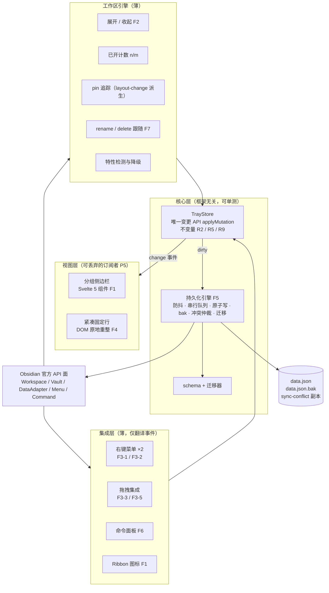
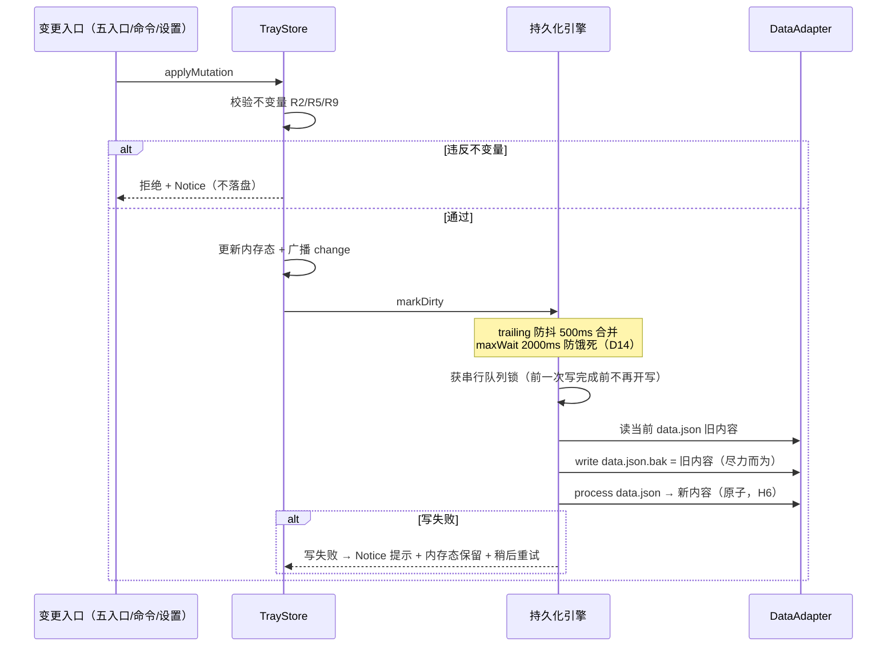
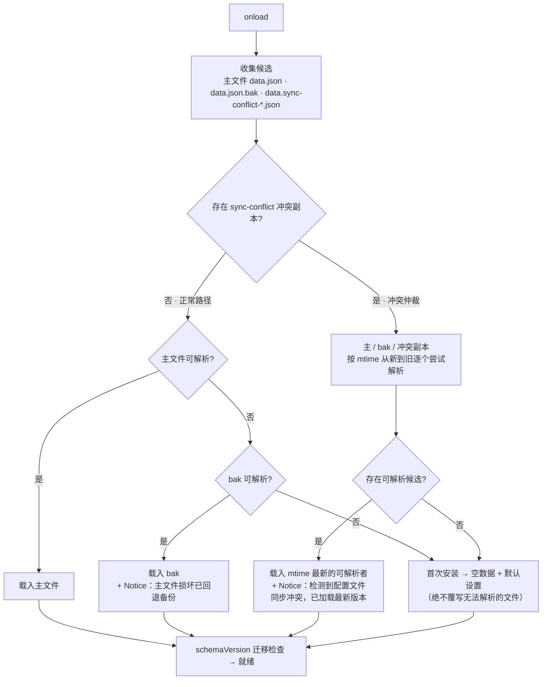
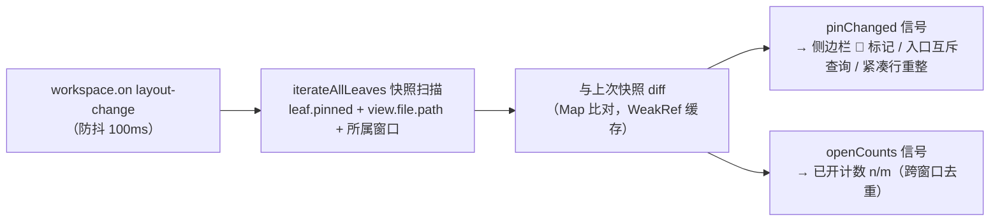

# Tab Tray 方案设计文档（SD）

| | |
|---|---|
| 产品名 | **Tab Tray**（插件 ID：`tab-tray`） |
| 上游需求 | [PRD v1.3（需求基线，2026-10-05 评审修订吸收）](./PRD.md) |
| 文档状态 | **v1.0 —— 关键选型已确认（4 项用户决策），进入开发前评审** |
| 日期 | 2026-10-05 |
| 读者 | 开发者本人（solo + AI 辅助）、未来的自己、潜在协作者 |

**本文档与 PRD 的分工**：PRD 回答「做什么、为什么、做到什么程度算完」；本文档回答「怎么做、用什么做、分几步做、做不成怎么办」。PRD 中标注 ✅ 的结论本文直接引用；PRD 中 ❓/🔶 的假设本文一律降级为 **Spike 验证项**（§4.4），不当作事实写进设计。

**决策状态图例**

- ✅ **已确认**：PRD 基线或用户 2026-10-05 拍板，本文的依据
- 🔶 **设计推导**：有明确理由的推荐方案，评审时可推翻（均在 §6.1 ADR 表中登记，标注可推翻性）
- 🧪 **Spike**：代码可验证的未知项，进入 T0 冲刺第一件事验证，均附兜底方案

---

## 目录

1. [方案总览](#1-方案总览)
2. [技术选型与对比](#2-技术选型与对比)
3. [系统架构设计](#3-系统架构设计)
4. [开发流程与工程实践](#4-开发流程与工程实践)
5. [测试与验收映射](#5-测试与验收映射)
6. [附录](#6-附录)

---

## 1. 方案总览

### 1.1 一句话架构

一个**单实例** Obsidian 桌面插件：**框架无关的核心层**（状态机 + 持久化引擎）是心脏，四类**薄适配层**（工作区引擎、Svelte 侧边栏、DOM 紧凑固定行、菜单/命令/拖拽集成）挂在核心层的事件上；一切成员变更汇入**唯一变更 API**，一切变更最终**防抖原子落盘**。

### 1.2 设计原则（后续所有细节的裁判）

| # | 原则 | 来源 |
|---|------|------|
| P1 | **官方 API 优先**：任何未文档化访问（DOM 结构、内部属性）必须先过特性检测门，失败即降级、绝不崩溃 | PRD §4.3、F4 |
| P2 | **单一事实源**：分组运行时状态只在内存 Store，持久状态只在 `data.json`；钉住状态从原生 leaf 派生、零存储（R6）；不另立任何事实源 | PRD R1/R6/D3 |
| P3 | **数据是资产**：写路径按「随时断电」设计——防抖合并、串行写队列、原子替换、`.bak` 轮换、损坏回退、冲突仲裁；卸载不清理（R10） | PRD F5/R10 |
| P4 | **降级不崩溃**：特性检测失败 → 置灰开关；菜单 source 失配 → DOM 兜底；拖拽格式未知 → 提示并退回右键入口 | PRD F4/H3 |
| P5 | **视图可丢弃**：侧边栏与固定行只是 Store 的订阅者，随时销毁重建不损数据；视图未开时命令与计数照常工作（F6） | PRD F6 |
| P6 | **入口归一**：F3 五个入口 + 命令面板 = 同一变更 API；互斥规则（R5）在 Store 层强制，UI 层不可绕过 | PRD F3/A2 |

### 1.3 架构图



### 1.4 技术栈总表

| 组件 | 选型 | 版本基线 | 角色 |
|------|------|----------|------|
| 语言 | TypeScript（strict） | 5.x | 全部源码 |
| 运行环境 | Obsidian Desktop | ≥ 1.13.0（安装器 Electron 43） | 唯一运行时 |
| 构建 | esbuild + esbuild-svelte | esbuild 0.2x | 产物单文件 `main.js`（IIFE） |
| 视图 | Svelte 5（runes） | 5.x | 仅侧边栏视图（F1） |
| 测试 | Vitest | 4.1+ | 核心层单元测试 |
| 代码质量 | Biome | 2.5.x | lint + format 一体 |
| 包管理 | npm | ≥ 10 | 依赖与脚本 |
| CI/CD | GitHub Actions | — | 检查 + 发布产物 |
| 样式 | 原生 CSS（`styles.css`） | — | 色板变量、紧凑行、视图样式 |
| i18n | 自建双层字典 | — | zh-CN / en（F8） |

---

## 2. 技术选型与对比

> 用户要求重点对比（软件开发迭代快，选型必须有时效依据）。以下对比以 **2026-10 时点**为准，关键版本事实均来自官方源（见 §6.4 参考资料）。

### 2.0 选型方法论

**约束画像**（PRD §4.2 ✅）：solo 开发、AI 辅助、每周数小时、MIT 免费、承诺维护 ≥ 6 个月。

由此推导的**评估维度与权重**：

| 维度 | 权重 | 理由 |
|------|------|------|
| 维护成本（6 个月+） | ★★★★★ | 无收入的个人项目，每一分维护负债都要自己扛 |
| Obsidian 生态适配 | ★★★★★ | 插件宿主强约束（加载方式、生命周期、CSP、多窗口） |
| 与 DOM 深度操作的距离 | ★★★★ | F4 紧凑固定行、拖拽、右键菜单全是 DOM 密集型工作，框架不能挡路 |
| AI 辅助友好度 | ★★★ | 开发方式是「solo + AI」，语料充足度直接影响迭代速度 |
| 体积/启动性能 | ★★ | 桌面端、单插件，非瓶颈，但不允许失控 |
| 学习曲线 | ★★ | 新工具的学习时间直接吃掉每周数小时的预算 |

### 2.1 语言：TypeScript（无悬念，简述）

| 对比项 | TypeScript | JavaScript |
|--------|-----------|------------|
| 官方支持 | ✅ sample-plugin 标配 + `obsidian.d.ts` 全量类型 | 需自己摸 API 签名 |
| AI 辅助 | ✅ 类型即提示词，AI 产出错误率显著更低 | — |
| 重构安全 | ✅ schema 演进（F5 schemaVersion）强依赖 | — |

**结论**：TypeScript 5.x，`strict: true`。不设 `any` 豁免（`unknown` + 收窄）。

### 2.2 构建：esbuild（PRD 已锁定 ✅）—— 与替代品的对比校验

PRD §4.3 已锁定「TypeScript + esbuild 标准插件工具链」，此处仍按用户要求做对比校验，确认锁定仍是对的：

| 工具 | 产物形态 | Obsidian 适配 | 生态位（2026-10） | 判定 |
|------|----------|---------------|-------------------|------|
| **esbuild** | 单文件 IIFE，`main.js` 即插即用 | ✅ 官方 sample-plugin 标配；watch 极快 | Go 实现，成熟稳定 | **采用** |
| tsup | esbuild 封装 | 可用但多一层抽象 | 通用库打包向 | 否：多余一层，官方模板不经过它 |
| Vite（lib mode） | 需配置产出 IIFE | 可用 | 2026 年仍是应用/库主流 | 否：为插件场景过重；仅作 esbuild-svelte 失效时的回退（见 E6） |
| Rollup | 产物可控 | 可用（老牌插件常用） | 已被 Vite/Rolldown 收编前端阵地 | 否：配置成本高、无增益 |
| Rolldown / unbuild | 新一代 | 观望 | 快速演进中 | 否：插件场景无收益，演进风险自担 |

**Svelte 编译补充**：esbuild 编译 `.svelte` 需要 **`esbuild-svelte`**（社区维护的 esbuild 插件，已支持 Svelte 5）。这是选 Svelte 的一个真实代价——多一个社区依赖，登记为风险 E6（回退：换 Vite bundler，或极端情况退回原生 DOM 视图；核心层不受影响，见 P5）。

### 2.3 UI 渲染：Svelte 5（✅ 用户确认）—— 完整对比记录

这是本插件最大的自由选型点。侧边栏视图的交互面：分组列表 + 拖拽排序 + 行内重命名 + 色板弹层 + 悬停 × + 丢失/📌 标记 + 实时计数。

| 维度 | **Svelte 5**（✅ 选定） | 原生 TypeScript DOM | React 19 | Preact + Signals |
|------|------------------------|---------------------|----------|------------------|
| 列表/状态样板量 | ★ 最少（keyed each + $state/$derived） | ★★★★ 全手写同步 | ★★ hooks 样板中等 | ★★ |
| DOM 级控制（DnD/菜单/行内编辑） | ★★ 编译产物即真实 DOM，可随时 `querySelector` + 原生事件 | ★ 最直接 | ★★★ 受虚拟 DOM 心智干扰，ref 转发繁琐 | ★★ |
| 与 Obsidian 生命周期桥接 | ★★ 需 mount/unmount 封装（~30 行） | ★ 无需 | ★★★ 需 root 桥接 + 严格模式陷阱 | ★★ |
| 体积增量 | ~几 KB | 0 | +40KB 级 | +4KB 级 |
| Obsidian 社区先例 | ✅ 成熟（Kanban、Dataview 等头部插件） | ✅ 官方样例路线 | 有先例但少 | 少 |
| AI 辅助语料 | 丰富（runes 已成 2026 主流写法） | 最多 | 最多 | 中等 |
| 6 个月演进风险 | 低（Svelte 5 于 2024-10 stable，2026 已主流） | 最低 | 低 | 中（生态位被 Svelte/React 两头挤压） |

**判定**：本插件视图是**单一列表型组件**，React 的组件生态优势用不上，虚拟 DOM 反而碍事（拖拽排序、行内编辑都是命令式活）；原生 DOM 可行但跨组拖拽 + 实时计数 + 双语切换的手写同步代码量最大、最易藏 bug。Svelte 5 编译期响应式恰好覆盖「状态→列表重渲染」这一痛点，产物仍是可直接操控的真实 DOM——两个维度的最优交点。用户已确认。

**桥接模式**（写入代码约定）：

```ts
// ui/sidebar/mount.ts —— 视图与 Obsidian 的唯一接触面
import { mount, unmount } from 'svelte';
import Sidebar from './Sidebar.svelte';

export function mountSidebar(contentEl: HTMLElement, store: TrayStore, i18n: I18n) {
  const comp = mount(Sidebar, { target: contentEl, props: { store, i18n } });
  return () => unmount(comp);   // ItemView.onClose() 调用
}
```

约定：`.svelte.ts` 中不 import `obsidian`；Svelte 组件不直接调 `app.workspace`（通过 props 注入 controller 回调）——保证视图层可替换、核心层可单测（P5/D9）。

### 2.4 测试：Vitest 4（✅ 用户确认）—— 对比与分层策略

| 对比项 | **Vitest 4**（✅ 选定） | Jest 30 | node:test |
|--------|------------------------|---------|-----------|
| 速度（watch 增量） | ✅ 亚秒级（2026 基准 ~400ms 量级） | 2–3s 量级 | 快但生态薄 |
| 配置成本 | ✅ 与 esbuild 生态同源，零转译配置 | 需 ts-jest/transform 配置 | 零依赖但断言/mock 弱 |
| 兼容 TS/ESM | ✅ 原生 | 需配置 | ✅ |
| 社区先例（插件类项目） | ✅ 2026 主流选择 | 老项目多 | 少 |
| 已知风险 | Browser Mode 有 CVE-2026-53633——**本项目只用 node 环境，不涉及** | — | — |

**分层测试策略**（✅ 用户确认「Vitest 单测核心层」）：

| 层 | 是否单测 | 方式 |
|----|----------|------|
| 持久化引擎（F5）：防抖、串行队列、原子写、`.bak` 轮换、损坏回退、冲突仲裁、迁移 | ✅ 全覆盖 | `ObsidianPort` 假实现（内存文件系统 + 可注入故障），fake timers |
| TrayStore 不变量：R2 唯一性、R5 互斥、R9 软阈值、rename 跟随、丢失标记 | ✅ 全覆盖 | 纯对象测试 |
| 展开/收起**决策函数**（D9）：plan 生成、去重（D4）、pinned 保留（R6）、窗口过滤（R11） | ✅ 全覆盖 | LeafSnapshot 假数据（纯函数） |
| 已开计数 n/m 跨窗口去重 | ✅ 全覆盖 | 纯函数 |
| i18n 字典完整性（en/zh key 对齐） | ✅ | 结构断言 |
| Svelte 组件、DOM 固定行、菜单/拖拽集成 | ❌ 不单测 | PRD §6 手动矩阵 + dogfood（理由：Obsidian 无官方 DOM 测试宿主，jsdom 模拟成本 > 收益） |

**可测性的结构性保障（D9，本设计最重要的工程决策之一）**：

1. **端口适配**：核心层只依赖 `ObsidianPort` 接口（文件读写、mtime、vault 事件、Notice、时钟），不 import `obsidian`——持久化引擎可在纯 Node 下全路径测试；
2. **决策/执行分离**：展开/收起拆成 `plan*(纯函数) → execute*(薄副作用)` 两段，把「关哪些 leaf、开哪些文件」的复杂逻辑变成可枚举输入输出的纯函数。

```ts
// core/port.ts —— 核心层唯一知道的世界
export interface ObsidianPort {
  readText(p: string): Promise<string>;
  writeText(p: string, data: string): Promise<void>;
  process(p: string, fn: (data: string) => string): Promise<string>;   // H6：原子
  listFiles(dir: string): Promise<string[]>;
  exists(p: string): Promise<boolean>;
  mtime(p: string): Promise<number | null>;
  onVaultRenamed(cb: (file: { path: string }, oldPath: string) => void): void;
  onVaultDeleted(cb: (file: { path: string }) => void): void;
  notice(msg: string): void;
  now(): number;
}
```

### 2.5 代码质量：Biome（✅ 用户确认）

| 对比项 | **Biome 2.5**（✅ 选定） | ESLint + Prettier | oxlint + Prettier |
|--------|--------------------------|-------------------|-------------------|
| 工具数量 | ✅ 1 个（lint+format+import 排序） | 2 套配置 2 套依赖 | 2 套 |
| 规则覆盖 | 561+ 规则（源自 ESLint/typescript-eslint 移植） | ✅ 最全 | 快速补齐中 |
| 速度 | ✅ Rust 实现，本仓库规模 <100ms | 慢一个数量级 | lint 快，format 靠 Prettier |
| 2026 状态 | 2.x 稳定线，活跃发版 | 事实标准 | 演进中 |

对本仓库规模（预计 <30 个源文件），规则覆盖差异无实际影响；单工具单配置对 solo 维护者是最优解。**约定**：`biome check`（lint+format 一并）+ `tsc --noEmit`（类型检查仍归 TypeScript，Biome 不替代）。

### 2.6 运行时基线与平台事实（设计所依赖的「地面」）

| 事实 | 值 | 来源状态 |
|------|-----|----------|
| 当前桌面版本 | 1.13.x（2026-07/08）；1.14.0 已出现于 changelog | ✅ 官方 changelog |
| 安装器内核 | Electron v43（1.13.4 起 43.1.1 → 43.3.0） | ✅ 官方 changelog |
| **minAppVersion** | **`1.13.0`**（🔶 D5：F4 所依赖的标签头 DOM 形态以 1.13.x 时代为准——竞品 Pinned Tabs Row 同样要求 1.13+；把「测过的版本」作为承诺下限，高于它的行为由 M8 矩阵守护） | 🔶 推导 |
| isDesktopOnly | `true`（PRD 非目标：移动端） | ✅ PRD §1.4 |
| 插件实例模型 | **每 vault 单实例，运行于主窗口上下文**；Popout 只是独立 `Document`，非独立插件实例 | ✅ 官方 popout 迁移指南（v0.15 架构） |
| pin 变化事件 | **官方不存在**；可行路径 = `layout-change` + 全 leaf 快照 diff | ✅ 检索核实（PRD F4 括注的 "pinned-change" 应理解为自建派生信号） |
| 可用 Web 平台能力 | Electron 43 内核下 `structuredClone`、`crypto.randomUUID`、`popover`、`:has()` 等全部可用（按 Chromium 130+ 全量口径保守设计） | ✅ 推导（保守口径） |
| 三平台差异 | Windows 路径大小写不敏感——路径一律取自 vault API（`TFile.path`），无手输路径入口，大小写天然一致 | ✅ 设计规避 |

### 2.7 小件决策清单（一次定完，避免实现期反复）

| 事项 | 选型 | 一句话理由 | 否决的替代 |
|------|------|-----------|-----------|
| 包管理器 | npm | 官方模板同款，零额外安装，Windows 友好 | pnpm（可随时换，成本≈0） |
| Node 版本 | 24 LTS（engines `>=22.12`） | 2026-10 活跃 LTS | 22（维护期） |
| schema 校验 | 手写类型守卫（~100 行）+ 单测 | schema 小而稳定；防同步损坏需要的是「严格拒绝」而非丰富报错；少一个运行时依赖 | zod / valibot（体积与心智对这个体量是过度引入） |
| 状态管理 | 自建 TrayStore（订阅模式，~80 行） | 核心层框架无关（P5/D9）是硬要求；第三方状态库无法满足「视图可丢弃」 | zustand / nanostores |
| i18n | 自建双层字典 + 类型安全 key | 只有两个语言、纯静态文案，i18next 是杀鸡牛刀 | i18next |
| 拖拽 | HTML5 DnD API | 浏览器原生跨窗格/跨窗口语义现成；Obsidian 文件树拖拽也走原生 DnD 管道 | 指针事件自绘（成本高、跨窗口难） |
| id 生成 | `crypto.randomUUID()` | 运行时原生 | uuid 包 |
| 样式载体 | 静态 `styles.css` + 类名开关 | 零运行时 CSS-in-JS；Obsidian 自动加载；明暗主题用 `.theme-dark/.theme-light` 变量 | 动态注入 `<style>`（仅紧凑行降级提示等极少数场景） |
| 版本管理 | `npm version` + `version-bump.mjs`（官方模板脚本）+ versions.json | 社区商店的标准姿势 | changesets（单包项目过度设计） |

### 2.8 明确否决项（记录否决理由，防止未来翻旧账）

| 否决项 | 理由 |
|--------|------|
| LowDB / 任何 JSON-DB 封装 | F5 需要自定义的防抖+原子+.bak+冲突仲裁写路径，LowDB 的简单 `write()` 反而挡路 |
| 直接使用 `plugin.saveData()/loadData()` | 它们写的就是 `data.json` 但不防抖不原子——与自管持久化引擎双写路径必然互踩（→ D7：全文件统一由持久化引擎管理） |
| MutationObserver 作为 pin/计数主路径 | PRD F4 明确要求事件驱动；紧凑行重整也一样。仅保留为极端兜底（不实现，除非 spike 证明 layout-change 覆盖不足） |
| Playwright/端到端 | Obsidian 无官方 e2e 宿主，Electron 多窗口 mock 成本远超 solo 画像（✅ 用户确认只做核心层单测） |
| Electron 原生模块 / `require('electron')` | 插件沙箱不提供，也永远不需要 |
| BroadcastChannel 跨窗口同步 | **不需要**——单实例架构下所有窗口共享同一 JS 上下文与 Store（§3.4）；仅作为未来架构变化时的备选记录 |

---

## 3. 系统架构设计

### 3.1 模块划分与依赖方向

依赖规则：**只允许上层依赖下层**（集成/视图/引擎 → 核心），核心层不 import 任何 Obsidian 类型（仅经 `ObsidianPort`）；`main.ts` 是唯一知道一切的装配点。

| 模块 | 职责 | PRD 映射 | 依赖 |
|------|------|----------|------|
| `core/types.ts` | schema v1 类型 + 手写守卫 + 不变量常量 | F5, R1/R2/R9 | — |
| `core/store.ts` | TrayStore：状态容器 + `applyMutation` 唯一变更 API + change 事件 | F1/F3, P6 | types |
| `core/persist.ts` | 持久化引擎：防抖、串行队列、原子写、.bak、回退、冲突仲裁 | F5 | types, port |
| `core/migrate.ts` | schemaVersion 迁移链（纯函数） | F5 | types |
| `core/port.ts` | ObsidianPort 接口定义 | D9 | — |
| `workspace/plan.ts` | 展开/收起/计数的**纯决策函数** | F2, R6/R11 | types |
| `workspace/execute.ts` | 决策的薄执行器（调 workspace API） | F2 | plan, obsidian |
| `workspace/pin-tracker.ts` | layout-change → 快照 diff → pinChanged 信号；同时产出计数快照 | F4, R6 | obsidian |
| `workspace/file-follow.ts` | vault rename/delete → store 跟随/标记丢失 | F7, R4 | store |
| `workspace/compat.ts` | 紧凑行特性检测（两级，D18） | F4 | obsidian |
| `ui/sidebar/` | Svelte 5 侧边栏（组件 + controller） | F1 | store, i18n |
| `ui/pinned-row.ts` | 标签头原地重整控制器 | F4 | pin-tracker, compat |
| `integrations/menus.ts` | 两处右键菜单 + DOM 兜底 | F3-1/2 | store |
| `integrations/dnd.ts` | 文件树拖入 + 侧栏内部 DnD | F3-3/5 | store |
| `integrations/commands.ts` | 动态/全局命令 | F6 | store, execute |
| `settings.ts` | 设置页（语言/紧凑行开关/软阈值/赞助区） | T0, F4/F8 | store |
| `i18n/` | en + zh-cn 字典、t() | F8 | — |
| `main.ts` | 装配、生命周期、registerEvent 纪律 | T0 | all |

### 3.2 数据模型（schema v1）

```ts
// core/types.ts
export const COLOR_KEYS = ['red','orange','yellow','green','teal',
                           'blue','indigo','purple','pink','gray'] as const;
export type ColorKey = typeof COLOR_KEYS[number];      // R8：固定 10 色，无自由取色

export interface Member {
  path: string;          // vault 相对路径（POSIX 分隔符），R1：唯一可持久绑定物
  addedAt: number;       // epoch ms，排序兜底与调试用
}

export interface Group {
  id: string;            // crypto.randomUUID()，命令注册的稳定锚（D10）
  name: string;          // 用户可见名，可重命名；允许重名（一切定位走 id，见 D10）
  color: ColorKey;
  members: Member[];     // 数组顺序 = 组内排序；拖拽排序 = 数组重排
}

export interface Settings {
  language: 'auto' | 'zh-CN' | 'en';
  compactPinnedRow: boolean;     // F4 开关，默认 true
  compactPinnedRowAvailable: boolean; // 特性检测结果缓存（D18 运行时自检后回写）
  softLimit: number;             // R9 软阈值，默认 30
}

export interface TrayData {
  schemaVersion: 1;
  settings: Settings;
  groups: Group[];       // 数组顺序 = 分组排序；R3：vault 级，天然随文件隔离
}
```

**不变量**（Store 层强制，违反 = 拒绝 + Notice，绝不静默修正）：

1. `groups[].id` 全局唯一（uuid 冲突概率忽略，仍做插入前断言）；
2. 任意 `member.path` 在**全部分组**中唯一（R2）；加入已属于他组的文件 = **移动**到目标组并提示原组名（D11，Chrome 心智）；
3. `member.path` 只能来自 vault API 返回值（R7：无路径的未保存新标签在入口层拒绝）；
4. 空分组合法（R9）；分组/成员数超 `softLimit` 时提示但放行；
5. **data.json 中没有、也永远不新增**钉住状态字段（R6：pin 从 leaf 派生）。

**磁盘布局**（插件目录内）：

| 文件 | 角色 | 写者 |
|------|------|------|
| `data.json` | 主文件（设置 + 分组） | 持久化引擎（唯一写者，D7） |
| `data.json.bak` | 上一份完好主文件（每次成功写前轮换） | 持久化引擎 |
| `data.sync-conflict-*.json` | 同步工具产生的冲突副本 | **只读参与竞选**，绝不改名/删除（F5/M7） |

### 3.3 关键机制设计

#### 3.3.1 持久化引擎（F5 —— 产品存在的理由，最重笔墨）

**写路径**：



设计要点：

1. **绝不依赖退出时机**（PRD 原文）：`onunload` 不承担落盘职责——任何时刻强杀，磁盘上最多落后 500ms~2s 的合并窗口（M9 验收覆盖）；
2. **串行写队列**：防抖只是合并入口，真正的纪律是「同一时刻至多一个写操作在飞」，杜绝自竞争；
3. **`.bak` 轮换顺序**：先写 `.bak`（旧内容）再写主文件。任一时刻断电：主文件要么旧要么新（原子），`.bak` 恒为更旧的完好版本——**任何单点损坏都有至少一份完好数据**；
4. **设置同管**（D7）：设置变更也走 `markDirty`，`plugin.saveData()` 在本插件中禁止调用；
5. **写失败的用户体验**：内存态不受影响（可继续操作），Notice 明示「本次更改尚未写入磁盘」，下个防抖窗口自动重试。

**读路径（启动恢复决策树）**：



设计要点：

1. **冲突竞选只在「检测到冲突副本」时触发**（F5 语义）；正常路径启动零额外开销；
2. 冲突文件**永不自动删除**（留给用户/同步工具），Notice 一次性提示（同会话去重）；
3. **迁移链**：`migrate(raw): { data } | { error }`，版本号逐级爬升（v1→v2→…），纯函数 + 单测；遇到**高于当前版本的 schemaVersion** → 拒绝加载、Notice「数据由更新版本插件创建，已保留原文件不覆盖」——向前不兼容时宁可不用也不损坏。

#### 3.3.2 状态与变更总线（P6 / F3-A2 的结构性保障）

```ts
// core/store.ts —— 概念签名
type Mutation =
  | { op: 'group.create'; name: string; color: ColorKey }
  | { op: 'group.rename'; groupId: string; name: string }
  | { op: 'group.recolor'; groupId: string; color: ColorKey }
  | { op: 'group.delete'; groupId: string }
  | { op: 'group.reorder'; order: string[] }
  | { op: 'member.add'; groupId: string; path: string }        // 内含 R2/R5 校验
  | { op: 'member.remove'; groupId: string; path: string }
  | { op: 'member.move'; from: string; to: string; path: string }
  | { op: 'member.reorder'; groupId: string; order: string[] }
  | { op: 'settings.update'; patch: Partial<Settings> };

class TrayStore {
  snapshot(): Readonly<TrayData>;
  applyMutation(m: Mutation): Result<void, RejectReason>;  // 唯一写入口
  on(evt: 'change' | 'reject' | 'persist-error', cb): Unsub;
}
```

F3 的五个入口与 F6 命令全部翻译成上述 `Mutation` 值对象；**R5 互斥校验在 `member.add` 内部完成**（查询 pin-tracker 派生状态：该 path 当前存在 pinned leaf → 拒绝 + 提示文案），UI 层不重复实现也不得绕过——这正是 A2「五入口结果一致」的结构性保证，也是「砍任一入口不省实质工作量」的反向收益：入口只是视图，纪律只有一份。

#### 3.3.3 pin 追踪与挂起-回归（R6 —— Chrome 心智模型的引擎侧）

官方无 pin 事件（§2.6），因此：



- **挂起**：成员被原生钉住 → pinChanged 扫描发现 → 侧边栏显示 📌；收起/展开替换的计划函数自动跳过；**data.json 零写动作**（状态纯派生，R6）；
- **回归**：取消固定 → 同一 diff 管道发现 → 📌 消失、恢复普通成员——「无需任何手动操作」（A9）就是「无状态需要恢复」的自然结果；
- **入口互斥（R5）**：`member.add` 时查询该 path 的派生 pin 状态；原生菜单层无法拦截 Obsidian 自带的「取消固定/固定」项（官方无手段），故不尝试——这正是挂起模型存在的原因（PRD v1.2 决议）。

#### 3.3.4 展开 / 收起引擎（F2，R6/R11/D4）

**决策/执行分离（D9）**——复杂度全部收进纯函数：

```ts
// workspace/plan.ts（纯函数，单测全覆盖）
interface LeafSnapshot {
  path: string | null;      // null = 无文件 leaf（如空标签）
  pinned: boolean;
  windowId: string;         // 主窗口固定 id；popout 按文档生成临时 id
  paneId: string;           // 标签容器（窗格）标识
}

function planExpand(mode: 'replace' | 'append',
                    members: string[],            // 组内序
                    activePaneId: string,
                    leaves: LeafSnapshot[]): ExpandPlan;
// replace：目标 = activePane 内全部非 pinned leaf 全关（pinned 一律保留，R6）；
//          组员【全量】按序打开（D4：窗格 = 完整组员集，允许与其他窗格重复）；
// append：组员中过滤掉当前窗口已打开者（D4：增量语义），剩余按序追加到 activePane 现有标签之后。

function planCollapse(group: string[],
                      currentWindowId: string,
                      leaves: LeafSnapshot[]): CollapsePlan;
// 关闭当前窗口内所有成员 leaf（跨窗格、同文件多窗格全关）；
// pinned 成员跳过并计数（提示「N 个成员因已固定未关闭」，F2）；
// 其他窗口（含 Popout）的 leaf 一律不在计划内（R11）。

function countOpen(members: string[], leaves: LeafSnapshot[]): number;
// n/m 的 n：成员 path 在全部窗口 leaf 集合中的去重命中数（R11）
```

**执行器**（`execute.ts`，薄、全部走官方 API）：

- 「当前窗口」判定：命令触发瞬间捕获 `activeWindow`；leaf 归属窗口用 `leaf.view.containerEl.ownerDocument.defaultView === activeWindow` 判定（全公开 DOM 推导，🧪Spike V0d 顺带验证是否有更直接的官方属性）；
- 替换的落点窗格 = 活动标签所在窗格；关闭 = 对计划内 leaf 逐个 `leaf.detach()`（单个失败 try/catch 继续，最终汇总提示）；
- 打开顺序：以窗格内存活 leaf 为锚聚焦后逐个 `workspace.getLeaf('tab')` + `leaf.openFile(file, { active: false })`，最后激活第一个成员标签——避免逐个抢占焦点造成闪烁（🧪Spike V0b 验证该组合在替换场景的稳定行为）；
- 触发源：侧边栏点击分组 / F6 命令 / 侧边栏双击（交互细化：单击组名=展开? 侧边栏条目交互在 T2 中按「点击组名=展开/收起切换，悬停出操作钮」实现，与 F1 成员点击语义不冲突）。

**冲突语义补全说明**：D4（替换全开、追加去重）是 2026-10-05 用户确认的 PRD 缺口补全；若未来推翻，改动局限于 `planExpand` 一个函数 + 对应单测——这就是决策/执行分离买到的保险。

#### 3.3.5 紧凑固定行（F4 —— 唯一的灰色地带，防御性最强的一块）

**实现路线**（PRD ✅ 已定：原地重整，参照 compact-pinned-tabs 已验证路径）：

1. **纯 CSS 排左（D16）**：标签头是 header 容器的 flex 子元素 → 对 pinned leaf 的 header 加类 `.tab-tray-pinned-compact`，`styles.css` 中以 `order: -1` 排到左侧 + 隐藏标题元素 + 收缩为图标宽度。**零 DOM 移动、零内部容器**——DOM 操作只有 `classList.add/remove`，这是对 Obsidian 升级最钝感的形态；
2. **事件驱动**：消费 pin-tracker 的 `pinChanged` 信号（防抖），不使用 MutationObserver（PRD F4 明确）；
3. **leaf↔header 映射**：参照 compact-pinned-tabs 的 WeakMap 身份映射方案；具体取法（DOM 遍历推导 vs 内部属性）在 🧪Spike V0d 定案；
4. **交互零劫持**：左键激活、右键原生菜单（经官方 `file-menu` 事件自然挂载，H3）、中键原生关闭并取消固定——我们只改视觉不改事件，与 D3「与原生生态共生」一致；tooltip 用原生 `aria-label`（悬停显示完整文件名）；
5. **两级特性检测（D18）**：
   - **静态级**（load 时）：断言标签头 DOM 结构存在（`.workspace-tab-header` 及标题子元素类名、flex 布局特征）→ 失败：`compactPinnedRowAvailable=false` 回写设置 → 设置项**置灰** + 提示「紧凑固定行在当前 Obsidian 版本不可用，不影响分组功能」（F4 ✅）；
   - **运行时自检级**（首次 pin 事件时）：映射失败（找不到对应 header）→ 同上降级 + Notice 一次。两级都以 Tab Tint 模式失效为底线：**失效 = 不生效，绝不是崩溃**（PRD R2 风险缓解）；
6. 图标 = 原生文件类型图标（复用 header 内已有 icon 元素，不自制）。

#### 3.3.6 失效与跟随（F7 / R4）

| 时机 | 机制 |
|------|------|
| 运行中重命名/移动 | `vault.on('rename')` → store 内全组路径替换（含组内序不变）→ markDirty（M5a） |
| 运行中删除 | `vault.on('delete')` → 对应成员标记丢失（内存态：`missingPaths` 集合，**不写入 data.json**——路径仍在，文件回来即自动恢复）→ 侧边栏「丢失」样式（R4：绝不静默删除） |
| Obsidian 关闭期间外部变动 | 启动后台一次性 `exists()` 扫描（分批、idle 时执行，不阻塞启动）+ 侧边栏渲染时惰性校验兜底（D-惰性校验） |
| 展开时 | 对目标成员逐个 `exists()`：丢失成员跳过并提示，不中断其余成员展开 |

设计取舍：丢失状态**派生而不持久化**（同 R6 哲学：可从环境重建的状态绝不入库）——用户在 Obsidian 外把文件移回来，重启后「丢失」标记自动消失，无需任何迁移。

#### 3.3.7 成员入口与拖拽（F3）

| 入口 | 实现路径 | 兜底 |
|------|----------|------|
| F3-1 文件树右键 | `workspace.on('file-menu')`，`source === 'file-explorer'`，仅对 `TFile`（文件夹跳过，R7） | — |
| F3-2 标签头右键 | 同事件，`source === 'tab-header'` + 第四参 leaf（H3 ✅ 已验证） | 🧪 运行期探针：若会话内该 source 从未触发 → 启用 DOM `contextmenu` 自绘官方 `Menu` 兜底（PRD 保留项） |
| F3-3 文件树拖入 | 视图容器注册 `dragover/drop`；取数优先级：`app.dragManager.draggable`（Obsidian 内部拖拽对象）→ `dataTransfer.getData('text/plain')` 解析路径 | 🧪Spike V0c 定格式；解析失败 → Notice 提示改用右键入口（P4） |
| F3-4 悬停 × | Svelte 行内按钮 → `member.remove` | — |
| F3-5 侧栏内拖拽 | HTML5 DnD：`application/x-tab-tray-member` 私有类型承载 `{groupId, path}`；拖到组头 = 移入该组尾部；组内落点 = 插入位指示线（rAF 节流） | — |

所有入口终点都是 `applyMutation`（§3.3.2）；已固定标签的「阻止 + 提示」由 Store 层统一执行（R5/Q2 ✅）。

#### 3.3.8 命令面板（F6）

- 动态命令：每分组注册 `open-group-<groupId>` / `collapse-group-<groupId>`（id 用 groupId 稳定，D10）；重命名 = 注销重建（name 含组名）；删除分组 = 注销命令；
- 全局命令：`new-group`、`collapse-active-group`（「当前分组」= 活动标签文件所属分组，无则提示，D12）、`open-sidebar`；
- 命令回调不触碰视图层（P5），视图关闭时完全可用（A6）；
- 命令量随分组数线性增长（2×组数），由 R9 软阈值提示间接覆盖。

#### 3.3.9 多窗口与 Popout 边界（R11，v1.3 新增条款的落地）

**架构事实**：每 vault 单插件实例（§2.6），主窗口与全部 Popout 共享同一 JS 上下文与同一个 TrayStore——**因此不存在跨窗口写竞争问题**（这是单写者结论的根据，D6；PRD M2「互不吞写」由此结构性满足）。

落地清单：

| 关注点 | 方案 |
|--------|------|
| 「当前窗口」捕获 | 命令/点击触发瞬间锁定 `activeWindow`，后续计划的窗口过滤全部基于此快照（避免执行中途窗口切换导致误伤） |
| 跨窗口 leaf 枚举 | `iterateAllLeaves` 天然覆盖全部窗口；窗口归属按 §3.3.4 判定 |
| 已开计数 | `countOpen` 跨全部窗口去重（R11 ✅） |
| 侧边栏视图被拖入 Popout | ItemView 本身支持；Svelte 事件绑定一律挂 `contentEl` 所在 document（禁止引用全局 `document`/`window`，🧪Spike V0e 手测） |
| 双进程同 vault | Obsidian 自身有 vault 锁（第二个进程无法打开同 vault），残余风险 = 平台行为变更，登记监控（E9），不预建机制 |

### 3.4 错误处理与可观测性

| 层 | 策略 |
|----|------|
| Store 不变量违反 | 拒绝 + 用户 Notice + debug 日志（开发期） |
| 持久化 IO 失败 | 内存态保留 + Notice + 自动重试；连续失败 → 设置页常驻警示条 |
| 数据解析失败 | §3.3.1 读路径决策树全兜底；**任何情况下不覆写无法解析的文件** |
| DOM 兼容失败 | P4 降级（置灰 + 提示），分组功能零影响 |
| 事件处理器异常 | `registerEvent` + 每个 handler 顶层 try/catch（单点异常不得炸掉整个 diff 管道） |
| 日志 | 统一 `[tab-tray]` 前缀；debug 日志受设置项控制（默认关）；不收集任何遥测 |

### 3.5 性能预算（定量承诺，超出即优化）

| 项 | 预算 | 手段 |
|----|------|------|
| 启动加载（onload 同步部分） | < 5ms | 无文件 IO；恢复走后台，UI 就绪不等待 |
| layout-change 快照扫描 | 防抖 100ms + O(n) diff | pin/计数共用一次扫描（§3.3.3） |
| 持久化 | 变更后 ≤500ms 落盘；写操作 O(data) | 防抖 + 串行队列 |
| 侧边栏渲染 | keyed list 增量更新 | Svelte keyed each |
| 拖拽 | 落点指示 rAF 节流 | — |

### 3.6 安全与隐私

- 零网络请求、零遥测、零外部进程（社区商店审查红线，天然合规）；
- 产物禁 `eval`（esbuild IIFE + Svelte 编译产物均满足）；
- 数据全部本地：`data.json` 由用户自选同步方案漫游（H5 ✅，写入用户文档）；
- 不读取成员文件内容（只用路径与元数据）——最小权限姿态。

### 3.7 目录结构

```
tab-tray/
├─ docs/                      # PRD、本设计文档
├─ src/
│  ├─ core/                   # 框架无关（可单测）
│  │  ├─ port.ts              # ObsidianPort 接口
│  │  ├─ types.ts             # schema + 守卫
│  │  ├─ store.ts             # TrayStore + applyMutation
│  │  ├─ persist.ts           # 持久化引擎
│  │  └─ migrate.ts           # 迁移链
│  ├─ workspace/              # Obsidian 工作区适配（薄）
│  │  ├─ plan.ts              # 纯决策函数
│  │  ├─ execute.ts           # 执行器
│  │  ├─ pin-tracker.ts       # layout-change 派生信号
│  │  ├─ file-follow.ts       # rename/delete 跟随
│  │  └─ compat.ts            # 特性检测
│  ├─ ui/
│  │  ├─ sidebar/             # Svelte 5 组件 + controller + mount
│  │  └─ pinned-row.ts        # 紧凑固定行控制器
│  ├─ integrations/
│  │  ├─ menus.ts  ├─ dnd.ts  ├─ commands.ts
│  ├─ settings.ts  ├─ i18n/   ├─ styles.css
│  └─ main.ts                 # 装配点
├─ esbuild.mjs  ├─ vitest.config.ts  ├─ biome.json  ├─ tsconfig.json
├─ manifest.json  ├─ versions.json
├─ README.md（en 主体 + zh 链接）
└─ .github/workflows/ci.yml + release.yml
```

---

## 4. 开发流程与工程实践

### 4.1 开发环境与日常工作流

| 项 | 内容 |
|----|------|
| Node | 24 LTS（`engines: >=22.12`） |
| 测试 vault | 仓库外独立 `dev-vault/`（含多类型文件：md/canvas/pdf/图片 + 预造的失效路径），`.obsidian/plugins/tab-tray` 以 **hot-reload 插件**驱动的软链/复制接入 |
| 反馈环 | `npm run dev`（esbuild watch + hot-reload）——保存到 Obsidian 重载 < 1s |
| 脚本矩阵 | `dev` / `build` / `test`（vitest run）/ `test:watch` / `lint`（biome check）/ `typecheck`（tsc --noEmit）/ `bump`（version-bump.mjs） |
| AI 协作 | 每个任务以本设计文档对应小节为上下文喂给 AI；单测先行的模块（core）让 AI 产出可验证 |

### 4.2 分支与提交策略（solo 版 trunk-based）

- **main 永远可发布**：每个 commit 过 lint + typecheck + test（本地随手跑，CI 强制）；
- 不设 develop/feature 长分支；高风险实验（如 Spike V0d 的映射方案）用短命分支，定案即合；
- Conventional Commits（`feat: / fix: / test: / chore: / docs:`）——发布日志（changelog）直接由 commit 历史 + 手写要点生成；
- 版本 tag `v0.x.y` 触发发布流水线。

### 4.3 CI/CD（GitHub Actions）

```yaml
# ci.yml 要点（push / PR 触发）
jobs:
  check:
    steps:
      - npm ci
      - npm run lint           # biome check
      - npm run typecheck      # tsc --noEmit
      - npm test               # vitest run（core 全绿）
      - npm run build          # esbuild 产物
      - 上传 artifact：main.js / manifest.json / styles.json

# release.yml（tag v* 触发）
jobs:
  release:
    steps:
      - npm ci && npm run build
      - 校验 manifest.json 版本 == tag、versions.json 已含新版本（version-bump.mjs 产物）
      - 创建 GitHub Release，附 main.js / manifest.json / styles.json   # 社区商店拉取的三件套
```

### 4.4 Spike 冲刺（T0 前置，第 0 周前两天，每项 ≤0.5 天）

> PRD V0 只剩两项确认动作；本设计新增三项实现路径验证。**每个 Spike 的产出 = 一页决策记录**（结论 + 证据 + 对设计的影响），回填本表。

| # | 验证点 | 方法 | 通过标准 / 兜底 |
|---|--------|------|------------------|
| V0a | `file-menu` 事件 `source === "tab-header"` 在目标版本实测 | 临时监听打印 source | 触发即过；不触发 → 启用 DOM contextmenu 兜底（H3 已验证，此为确认动作） |
| V0b | `adapter.process` 原子性 + `rename` 可用性实测；展开用的 `getLeaf('tab')` 锚点组合行为 | 小脚本 + 杀进程验证 | M9 场景预演通过；异常 → 退「tmp 文件 + rename」等效策略（F5 预留） |
| V0c | 文件树拖入的内部数据格式（dragManager / dataTransfer） | 拖拽时打印两路数据 | 拿到稳定路径来源即过；拿不到 → F3-3 提示改用右键（入口不减） |
| V0d | pin 变化检测覆盖度 + leaf↔header 映射取法 + 「当前窗口」归属判定 | 重读 compact-pinned-tabs 映射实现 + 本地 probe | layout-change 能覆盖 pin/unpin 即过；映射不可得 → F4 静态检测置灰（P4） |
| V0e | 多窗口模型确认（新主窗口/popout 共享单实例）+ Svelte 视图拖入 popout 的事件面 | 双窗口手测脚本 | 单实例成立即过（D6 前提）；异常 → 启动 BroadcastChannel 备选设计（§2.8 记录） |

### 4.5 里程碑与任务 DoD（对齐 PRD §7 T0–T8 与 §4.2 排期 🔶 4~6 周）

| 周 | 任务（PRD） | DoD（完成的客观标准） | 对应验收 |
|----|-------------|------------------------|----------|
| W0 | Spike + T0 脚手架 | V0a–V0e 决策记录回填；`dev/build/test/lint/typecheck` 全通；manifest(id=tab-tray, minAppVersion 1.13.0)、i18n 骨架、设置页（语言/紧凑行开关/软阈值/赞助区）可用 | — |
| W1–W2 | T1 数据层 + T2 侧边栏 → **M1** | persist/store/migrate 单测全绿（§5.1 清单）；侧边栏 CRUD/排序/改色/丢失标记/计数可用；**M1/M3/M4 手测过** | A1、A7 部分、A8 |
| W3 | T3 入口 + T4 展开收起 + T6 命令 → **M2** | 五入口归一 applyMutation；plan 纯函数单测全绿；动态命令注册/注销；「替换/追加/收起」含 R6/R11/D4 全语义 | A2、A3、A4、A6、A9 |
| W4 | T5 紧凑固定行 → **M3** | 两级特性检测；CSS 排左重整；tooltip/右键/中键原生行为；开关与置灰降级 | A5 |
| W5 | T7 验收执行 | **§6.2 矩阵 M1–M9 全绿**（含写盘杀进程 M9、同步冲突 M7 造数实测）+ A1–A9 全量执行记录归档 → `v0.9.0` 进入 dogfood | 全部 |
| W6–W7 | dogfood ≥2 周（V2）+ 实装对比（V3）+ 同步漫游实测（V4） | 问题清单清零；差异化话术定稿；H5 文档结论落定 | — |
| W8 | T8 发布 → **M4** | README(en+zh)/GIF/赞助位/变更日志；`v1.0.0` Release 三件套；社区商店提交 PR | — |

排期弹性：W5 验收与 W6 dogfood 可穿插；PRD 允许 4~6 周浮动，本表按 6 周口径绘制，M1 提前达成则整体前移。

### 4.6 工程风险登记（在 PRD §5.1 之上的实现层补充）

| # | 风险 | 等级 | 缓解（设计内建） | 验证点 |
|---|------|------|------------------|--------|
| E1 | tab-header source 串随版本变化 | 中 | DOM contextmenu 兜底常备（F3-2） | V0a + 每次升级回归 |
| E2 | 文件树拖入的内部拖拽数据无契约 | 中 | V0c 定格式；失败退右键入口 + 提示 | V0c |
| E3 | leaf↔header 映射依赖内部结构（F4 最大维护负债） | 高 | 纯 CSS order 重整（零 DOM 移动）+ 两级检测 + 置灰降级；竞品同路径先例 | V0d + M8 |
| E4 | layout-change 高频风暴拖垮计数/pin 管道 | 中 | 防抖 + O(n) diff + 单次扫描双信号 | 单测 + 大 vault 手测 |
| E5 | Svelte 视图拖入 Popout 后事件挂错 document | 中 | 事件全挂 contentEl 所属 document 的纪律 + Spike 手测 | V0e |
| E6 | esbuild-svelte 与 Svelte 5 兼容演进 | 低 | 版本锁定；回退 = Vite bundler（视图层替换，core 不动） | 依赖升级时跑 CI |
| E7 | Obsidian 1.14+ 破坏假设 | 高（PRD R2 同源） | P1/P4 全部机制 + M8 进维护节奏 | 每个桌面版发布后 |
| E8 | process 原子性与平台差异（Windows/macOS/Linux） | 中 | .bak 先行轮换兜底；M9 三平台实测 | V0b + M9 |
| E9 | 单实例假设未来失效（双进程同 vault） | 低 | mtime 写前复核（实现成本 1 行）+ 监控登记 | V0e 确认前提 |

### 4.7 发布流程

1. **版本策略**：M1=`0.1.0`、M2=`0.2.0`、M3=`0.3.0`、验收过=`0.9.0`（dogfood）、市场提交=`1.0.0`；每次 `npm version` 由 `version-bump.mjs` 同步 manifest + versions.json；
2. **社区商店提交清单**：manifest 字段合规（id/描述长度）、README en 主体 + zh 链接、GIF 演示（≤ 600px 宽惯例）、无 eval/遥测/网络、`isDesktopOnly: true`、minAppVersion 与 versions.json 一致、赞助链接置于 README 与设置页「关于」（PRD §4.1）；
3. **发布后 4 周密集期**（V5）：issue/评价每周汇总一次，作为 v1.1（按分组染色 🔶 H7）决策输入——**v1.1 启动前重开本设计文档做增量修订**，染色属灰色地带 API，需独立特性检测设计。

### 4.8 维护计划（6 个月承诺的可持续化）

| 节奏 | 动作 |
|------|------|
| 每个 Obsidian 桌面版发布 | 跑 M8（升级一版后分组行为不变）+ A5 紧凑行冒烟；DOM 破坏 → compat 更新或降级 |
| 每周 | issue triage 一次（≥30 分钟）；bug 修复按 trunk-based 直进 main |
| 每月 | 依赖 minor 升级（锁 major）；备份一份 data.json 到测试 vault 演练 M7 |
| v1.1 决策点 | 前置评估染色（H7）与「钉住整组」「组色角标」候选（PRD §2.3） |

---

## 5. 测试与验收映射

### 5.1 单元测试清单（core 层，Vitest）

| 模块 | 用例（全部以「断言 + 故障注入」表达） |
|------|--------------------------------------|
| persist 写路径 | 正常写盘内容与 schema 一致；500ms 防抖合并多次变更（fake timers）；maxWait 兜底触发；写队列串行（并发 markDirty 不产生交错写）；写前 `.bak` = 旧内容；`.bak` 写失败不影响主文件写入；`process` 抛错 → 内存态保留 + persist-error 事件 |
| persist 读路径 | 主文件正常加载；主文件损坏 → 回退 `.bak` + 通知事件；主文件与 bak 均坏 → 冲突副本按 mtime 竞选；冲突副本存在时主文件正常也触发竞选（最新胜出 + 通知）；全部不可解析 → 空数据初始化且**不覆写坏文件**；高于当前 schemaVersion → 拒绝加载 |
| migrate | v0→v1 迁移正确性；字段缺失/多余容错；非法类型拒绝 |
| store 不变量 | R2：加入他组成员 → 移动 + 提示（D11）；R5：pinned 路径 add 被拒；R9：超软阈值放行 + 提示事件；空组合法；组重名拒绝 |
| file-follow | rename 跟随（含组内序保持）；delete → 丢失标记（内存派生，不入盘）；文件回归 → 标记自动消失 |
| plan（展开/收起/计数） | replace：pinned 保留、无文件 leaf 清理、组员全量开（D4）；append：已开成员过滤（D4）；collapse：跨窗格全关、他窗口隔离（R11）、pinned 跳过计数、重复多窗格全关；countOpen 跨窗口去重；丢失成员跳过 |
| i18n | en/zh key 集合一致；插值参数渲染；auto 语言解析 |

### 5.2 PRD 验收矩阵 ↔ 设计机制映射（M1–M9 为什么会绿）

| 矩阵 | 由哪些机制保证 | 环境与补测 |
|------|----------------|------------|
| M1 正常重启 | P3 全套（防抖 + 原子 + 串行） | 手测 |
| M2 多窗口同 vault | D6 单实例单写者 + R11 窗口过滤 | 双窗口手测 |
| M3 禁用→重启→启用 | data.json 独立于插件生命周期（R10，卸载不清） | 手测 |
| M4 workspace 切换 | R3 vault 级存储 + 不绑 workspace | 手测 |
| M5a 运行中重命名 | file-follow rename 订阅 | 手测 + 单测 |
| M5b 关闭期外部重命名 | 启动惰性 exists 扫描 + 丢失标记（不删除） | 手测 |
| M6 删除组内文件 | delete → 内存丢失标记 | 手测 + 单测 |
| M7 同步冲突副本 | §3.3.1 读路径竞选 + 冲突文件只读 | 造数（手工构造 sync-conflict 文件）手测 + 单测 |
| M8 升级一版 | P1 官方 API 面 + P4 检测降级 + compat 两级检测 | 版本发布节奏执行 |
| M9 写盘中杀进程 | 原子写 + .bak 先行轮换 + 串行队列 | 三平台实测（V0b 预演） |

### 5.3 dogfood 脚本要点（W6–W7，≥2 周）

- 日常真实 vault 全量使用：≥10 分组、跨 3 主题工作流、含 canvas/pdf/图片成员；
- 每日至少一次「重启 + 多窗口 + 收起/展开」组合操作；每周一次手动破坏 data.json 验证回退提示；
- 记录模板：时间 / 操作 / 预期 / 实际 / 严重度——问题清零是 M4 门槛（PRD V2）。

---

## 6. 附录

### 6.1 决策记录（ADR 摘要）

| # | 决策 | 状态 | 理由摘要 | 可推翻性 |
|---|------|------|----------|----------|
| D1 | 侧边栏视图 = Svelte 5 | ✅ 用户确认 2026-10-05 | §2.3 对比；视图层可整体替换（P5） | 中——回退原生 DOM 只动 `ui/sidebar` |
| D2 | Vitest 4 核心层单测 | ✅ 用户确认 | §2.4；F5 是产品主张，回归必须自动 | 低 |
| D3 | Biome 2.5 | ✅ 用户确认 | §2.5；单工具最低维护 | 高——换 ESLint 成本半天 |
| D4 | 展开去重：替换全量开、追加去重 | ✅ 用户确认（PRD 缺口补全） | 「窗格=该组」直觉 + 增量语义不制造重复；改动局限于 planExpand | 中——语义级决策，改前需知会用户 |
| D5 | minAppVersion = 1.13.0；isDesktopOnly | 🔶 | 测过版本即承诺下限；移动端为 PRD 非目标 | 中——放宽需重跑验收 |
| D6 | 单实例单写者，不建跨窗口 IPC | 🔶 | 官方 popout 架构事实（§2.6）；V0e 确认前提 | 低——若前提变，启用 §2.8 备选 |
| D7 | 设置与分组同管 data.json，禁用 saveData | 🔶 | 消灭双写路径互踩 | 低 |
| D8 | 手写 schema 守卫，不引 zod | 🔶 | §2.7 | 高——引入成本半天 |
| D9 | ObsidianPort 注入 + 决策/执行分离 | 🔶 | 可测性的结构性保障（§2.4/§3.3.4） | 低 |
| D10 | 命令 id 用 groupId；改名重建命令 | 🔶 | 重命名不影响用户已绑快捷键 | 低 |
| D11 | 加入已属他组 = 移动 + 提示 | 🔶 | Chrome 心智（PRD v1.2 对齐） | 中 |
| D12 | 「收起当前分组」= 活动标签文件所属分组 | 🔶 | F6 语义补全 | 中 |
| D13 | 备份名 `data.json.bak`；冲突副本只读 | 🔶 | 与 sync-conflict 命名族共存 | 高 |
| D14 | 防抖 500ms + maxWait 2000ms | 🔶 | PRD ≤500ms 约束的防饿死补全 | 高 |
| D15 | i18n：auto（跟随 Obsidian 语言）+ 手动覆盖 | 🔶 | F8 双语 | 高 |
| D16 | 紧凑行纯 CSS `order` 排左，零 DOM 移动 | 🔶 | 对升级最钝感（§3.3.5） | 低——形态由 V0d 定案 |
| D17 | npm + Node 24 LTS | 🔶 | §2.7 | 高 |
| D18 | 特性检测两级：静态结构 + 运行时自检 | 🔶 | F4 降级可控（v1.3 评审条款） | 低 |

### 6.2 PRD 追溯矩阵

| PRD 条目 | 设计落点 |
|----------|----------|
| F1 分组侧边栏 | §3.1 ui/sidebar、§2.3、§3.3.2 |
| F2 展开/收起 + R11 | §3.3.4、§3.3.9、D4 |
| F3 五入口 | §3.3.7、§3.3.2 |
| F4 紧凑固定行 | §3.3.5、D16/D18、§4.4 V0d |
| F5 持久化引擎 | §3.3.1、D13/D14、§5.1 |
| F6 命令面板 | §3.3.8、D10/D12 |
| F7 重命名跟随 | §3.3.6 |
| F8 双语 | §2.7 i18n、D15 |
| R1–R11 | §3.2 不变量、§3.3 全部、§3.3.9 |
| §6.1 A1–A9 | §5.1/§5.2 映射 |
| §6.2 M1–M9 | §5.2 映射表 |
| §7 T0–T8 | §4.5 里程碑 DoD |
| §4.3 技术约束 | §2.2/§2.6、§3.3.5、H3/H4/H5/H6 全部吸收 |
| §5.3 验证计划 V0–V5 | §4.4 Spike、§4.5 W5–W7、§4.7 发布后 |

### 6.3 术语表

| 术语 | 含义 |
|------|------|
| 窗格（pane） | Obsidian 的标签容器（一组标签的宿主），「替换当前窗格」的作用域 |
| Popout Window | 从主窗口弹出的独立 OS 窗口（独立 Document，非独立插件实例） |
| 挂起成员 | 已被原生钉住的组员（📌），收起/替换时跳过，取消固定自动回归（R6） |
| leaf | Obsidian 工作区最小视图单元，一个打开的标签 |
| Spike | 开发期用最小代码验证未知项的冲刺动作 |
| 决策/执行分离 | 复杂逻辑收进纯函数（plan），副作用隔离在薄执行器（execute）的模式 |

### 6.4 参考资料（2026-10 检索来源）

**官方**
- Obsidian 官方 changelog（1.13.x Electron 43：[2026-07-30-desktop-v1.13.4](https://obsidian.md/changelog/2026-07-30-desktop-v1.13.4)、[2026-08-10-desktop-v1.13.6](https://obsidian.md/changelog/2026-08-10-desktop-v1.13.6)、[1.14.0](https://obsidian.md/changelog)）
- [Popout window 支持与插件迁移指南（v0.15 架构：插件实例在主窗口上下文）](https://obsidian.md/changelog/2022-07-05-desktop-v0.15.0/) 及 Excalidraw 处理先例（[0.15.0 popout 解决方案讨论](https://github.com)）
- [obsidian-sample-plugin](https://github.com/obsidianmd/obsidian-sample-plugin)（TS + esbuild + version-bump.mjs）
- Obsidian 开发者文档：DataAdapter（process/rename）、file-menu 事件、Workspace 事件（PRD H3/H6 已验证）
- [官方帮助：拖拽行为](https://obsidian.md/help/drag-and-drop)

**工具链**
- [Svelte 5 runes 官方文档](https://svelte.dev)；[Obsidian 论坛：React vs Svelte 插件选型讨论](https://forum.obsidian.md)
- [Vitest 4.0 发布公告（2025-10-22 stable）](https://vitest.dev/blog/vitest-4)、[Vitest 4.1（2026-03-12）](https://vitest.dev/blog/vitest-4-1.html)
- [Biome 官网（2.x，561+ 规则）](https://biomejs.dev)、[@biomejs/biome npm](https://www.npmjs.com/package/@biomejs/biome)
- esbuild-svelte（esbuild 的 Svelte 编译插件，支持 Svelte 5）

**竞品/先例**（PRD §3.1 深查结论的代码参照）
- [compact-pinned-tabs](https://github.com)（紧凑固定行原地重整路径：事件驱动、WeakMap 映射）
- [Drag Out](https://community.obsidian.md/plugins/drag-out) / [workbench-drag-path](https://community.obsidian.md/plugins/workbench-drag-path)（文件树拖拽与 dataTransfer 先例）
- Group Tabs（issue #4 立项契机）、Working tabs、Vertical Tabs、Color Tab（差异化对照，见 PRD §3）
